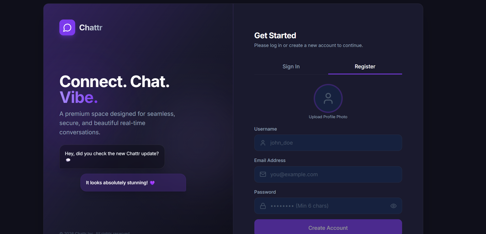
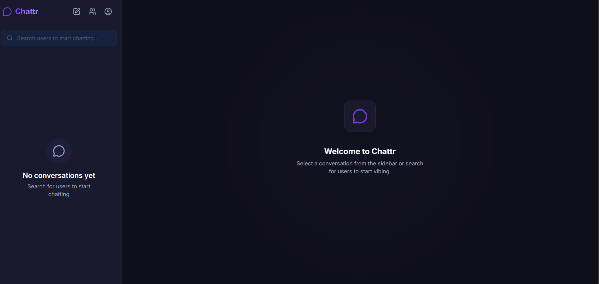
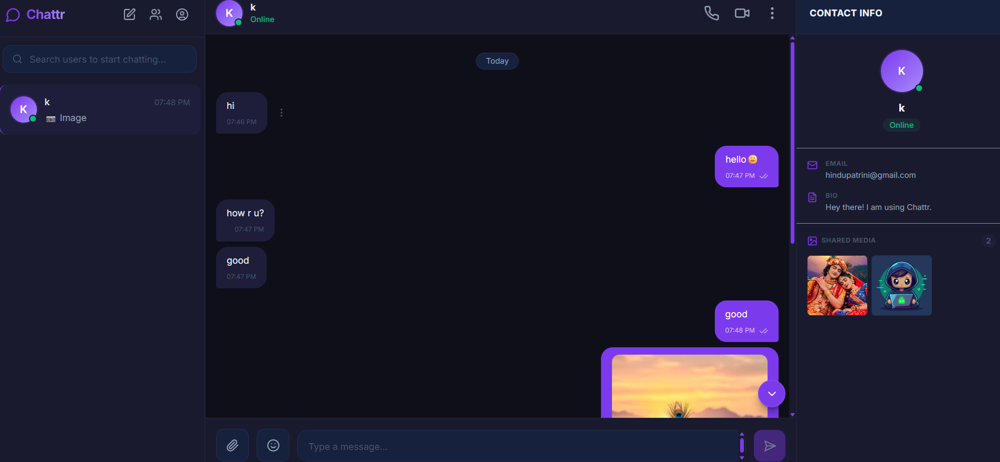

<div align="center">



<br/>
<br/>


# Chattr

### A premium real-time chat application built with the MERN stack + Socket.io

[](https://chattr-sandy.vercel.app/)
[](https://github.com/HinduPatrini/Chattr)
[](https://www.linkedin.com/in/hindu-patrini-7ab07a37a)

<br/>


</div>

---

## 🚀 Live Demo

🔗 **[https://chattr-sandy.vercel.app/](https://chattr-sandy.vercel.app/)**

> **Demo Account** — Try the app without registering:
> ```
> Email:    demo@chattr.com
> Password: demo1234
> ```

---

## 📸 Screenshots

### Login Page


### Chat — No Conversations


### Chat — Active Conversation


---

## ✨ Features

- 🔐 **JWT Authentication** — Secure register and login with bcrypt password hashing and JWT tokens
- ⚡ **Real-time Messaging** — Instant message delivery powered by Socket.io WebSockets
- 💬 **One-to-One DMs** — Private conversations between any two users
- 👥 **Group Chat** — Create groups, add members, rename, and manage with admin controls
- ✍️ **Typing Indicator** — Animated "user is typing..." powered by live socket events
- ✅ **Read Receipts** — Single tick (sent), double grey tick (delivered), double purple tick (read)
- 🟢 **Online / Offline Status** — Real-time presence indicator with last seen timestamps
- 🖼️ **Image Sharing** — Send images in chat, stored on Cloudinary with inline preview
- 🔍 **User Search** — Debounced live search to find users and start new conversations
- 🔔 **Unread Badge** — Unread message count per conversation, clears automatically on open
- 👤 **Profile Management** — Edit username, bio, and avatar with instant preview
- 📱 **Fully Responsive** — Seamless experience on both desktop and mobile devices

---

## 🛠️ Tech Stack

### Frontend
| Technology | Purpose |
|---|---|
| React 18 + Vite | UI framework and build tool |
| Tailwind CSS v3 | Utility-first styling |
| Zustand | Lightweight global state management |
| Socket.io Client v4 | Real-time WebSocket communication |
| React Router DOM v6 | Client-side routing |
| Axios | HTTP API requests with interceptors |
| Lucide React | Icon library |
| React Hot Toast | Toast notifications |

### Backend
| Technology | Purpose |
|---|---|
| Node.js + Express v4 | REST API server |
| MongoDB + Mongoose | Database and ODM |
| Socket.io v4 | WebSocket server for real-time events |
| JSON Web Token | Stateless authentication |
| Bcrypt.js | Secure password hashing |
| Cloudinary | Cloud image storage for avatars and media |
| Multer | Multipart file upload handling |

---

## 📁 Project Structure

```
chattr/
├── client/                        # React frontend
│   ├── public/
│   │   ├── favicon.svg
│   │   └── manifest.json
│   ├── src/
│   │   ├── api/
│   │   │   └── axios.js           # Axios instance with auth interceptor
│   │   ├── components/
│   │   │   ├── auth/              # LoginForm, RegisterForm
│   │   │   ├── chat/              # ChatWindow, ChatHeader, MessageBubble,
│   │   │   │                      # MessageInput, MessageList, TypingIndicator
│   │   │   ├── sidebar/           # Sidebar, ConversationList,
│   │   │   │                      # ConversationItem, SearchBar
│   │   │   ├── modals/            # NewChatModal, CreateGroupModal, ProfileModal
│   │   │   └── common/            # Avatar, Loader
│   │   ├── pages/
│   │   │   ├── AuthPage.jsx
│   │   │   ├── ChatPage.jsx
│   │   │   └── NotFoundPage.jsx
│   │   ├── store/
│   │   │   ├── useAuthStore.js    # Auth state (user, token, login, logout)
│   │   │   ├── useChatStore.js    # Chat state (conversations, messages)
│   │   │   └── useSocketStore.js  # Socket instance management
│   │   ├── hooks/
│   │   │   └── useSocket.js       # Custom hook for socket events
│   │   ├── App.jsx
│   │   ├── main.jsx
│   │   └── index.css
│   ├── vercel.json
│   └── package.json
│
└── server/                        # Node.js backend
    ├── src/
    │   ├── config/
    │   │   ├── db.js              # MongoDB connection
    │   │   └── cloudinary.js      # Cloudinary config
    │   ├── models/
    │   │   ├── User.js            # User schema
    │   │   ├── Conversation.js    # Conversation schema (DM + group)
    │   │   └── Message.js         # Message schema
    │   ├── controllers/
    │   │   ├── authController.js
    │   │   ├── userController.js
    │   │   ├── conversationController.js
    │   │   └── messageController.js
    │   ├── routes/
    │   │   ├── authRoutes.js
    │   │   ├── userRoutes.js
    │   │   ├── conversationRoutes.js
    │   │   └── messageRoutes.js
    │   ├── middlewares/
    │   │   ├── authMiddleware.js  # JWT verification
    │   │   └── errorMiddleware.js # Global error handler
    │   ├── socket/
    │   │   └── socketHandler.js   # All Socket.io events
    │   └── utils/
    │       ├── generateToken.js
    │       ├── cloudinaryUpload.js
    │       └── seeder.js          # Demo user seeder
    ├── server.js
    └── package.json
```

---

## ⚙️ Local Setup

### Prerequisites
- Node.js v18+
- MongoDB Atlas account (free tier)
- Cloudinary account (free tier)

### 1. Clone the repository

```bash
git clone https://github.com/HinduPatrini/Chattr.git
cd Chattr
```

### 2. Setup backend

```bash
cd server
npm install
```

Create `server/.env`:

```env
PORT=5000
MONGO_URI=mongodb+srv://<username>:<password>@cluster0.xxxxx.mongodb.net/chattr
JWT_SECRET=your_jwt_secret_here
JWT_EXPIRES_IN=7d
CLOUDINARY_CLOUD_NAME=your_cloud_name
CLOUDINARY_API_KEY=your_api_key
CLOUDINARY_API_SECRET=your_api_secret
CLIENT_URL=http://localhost:5173
NODE_ENV=development
```

Start the backend:

```bash
npm run dev
```

Backend runs on `http://localhost:5000`

### 3. Setup frontend

```bash
cd client
npm install
```

Create `client/.env`:

```env
VITE_API_URL=http://localhost:5000/api
VITE_SOCKET_URL=http://localhost:5000
```

Start the frontend:

```bash
npm run dev
```

Frontend runs on `http://localhost:5173`


---

## 🚢 Deployment

| Layer | Platform | Notes |
|---|---|---|
| Frontend | Vercel | Auto-deploys on every push to main |
| Backend | Render | Free tier — may take 30s to wake up |
| Database | MongoDB Atlas | Free M0 cluster |
| Media Storage | Cloudinary | Free tier, 25GB storage |

---

## 📄 Environment Variables Reference

### Server
| Variable | Description |
|---|---|
| `PORT` | Server port (default 5000) |
| `MONGO_URI` | MongoDB Atlas connection string |
| `JWT_SECRET` | Secret key for JWT signing |
| `JWT_EXPIRES_IN` | Token expiry duration (e.g. 7d) |
| `CLOUDINARY_CLOUD_NAME` | Cloudinary cloud name |
| `CLOUDINARY_API_KEY` | Cloudinary API key |
| `CLOUDINARY_API_SECRET` | Cloudinary API secret |
| `CLIENT_URL` | Frontend URL for CORS |
| `NODE_ENV` | development or production |

### Client
| Variable | Description |
|---|---|
| `VITE_API_URL` | Backend API base URL |
| `VITE_SOCKET_URL` | Backend Socket.io URL |

---

## 👨‍💻 Author

**Hindu Patrini**

[](https://www.linkedin.com/in/hindu-patrini-7ab07a37a)
[](https://github.com/HinduPatrini)
[](https://chattr-sandy.vercel.app/)

---

<div align="center">

⭐ **If you found this project helpful, please give it a star!** ⭐

<br/>

Made by Hindu Patrini

</div>
